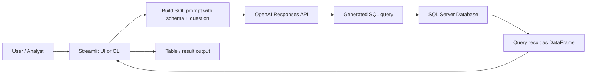

# DataGPT

DataGPT is a lightweight AI-powered SQL assistant for Microsoft SQL Server. It uses the schema of the `orders` table and an OpenAI model to convert natural-language questions into SQL, then executes the query against the database and displays the result in the UI or terminal.

The project has two entry points:

- A CLI script in [main.py](main.py) for direct terminal-based use.
- A Streamlit app in [streamlit_app.py](streamlit_app.py) for interactive querying in a browser.

---

## Overview

The application follows a simple pattern:

1. Load the database schema from SQL Server.
2. Send the schema + user question to the OpenAI API.
3. Ask the model to return only SQL.
4. Run the generated query against SQL Server.
5. Display the returned rows in the app or terminal.

This is useful for business users who want to ask questions like:

- What are the total sales by month?
- Which customers placed the most orders?
- Show the top 10 products by revenue.

---

## Architecture



### Key flow details

- [mydb.py](mydb.py) handles the database connection and schema discovery.
- [streamlit_app.py](streamlit_app.py) is the user-facing experience for browser-based interaction.
- [main.py](main.py) is a simpler command-line version of the same logic.
- [requirements.txt](requirements.txt) includes the Python packages required by the project.

---

## Project structure

```text
DataGPT/
├── main.py                  # CLI version of the SQL generation flow
├── mydb.py                  # SQL Server connection, schema fetch, and query runner
├── streamlit_app.py         # Web UI for natural-language SQL generation
├── requirements.txt         # Python dependencies
├── .env                     # Local environment variables (not committed)
├── .gitignore               # Ignores generated local files and secrets
├── myenv/                   # Local virtual environment
├── __pycache__/             # Python cache files
└── README.md                # Project documentation
```

---

## Files and responsibilities

### [main.py](main.py)

This script uses the OpenAI API directly from the terminal:

- loads environment variables
- fetches the `orders` schema
- asks the model for SQL only
- executes the generated SQL
- prints the result

This is the fastest way to test the core idea without running the Streamlit app.

### [mydb.py](mydb.py)

This file contains the database layer.

Responsibilities:

- create a SQLAlchemy engine for SQL Server
- connect using `pyodbc`
- run queries with `pd.read_sql`
- fetch the `INFORMATION_SCHEMA.COLUMNS` metadata for a table

Important logic:

- It currently targets the database named `retail`.
- It assumes a local SQL Server instance at `localhost\MSSQLSERVER03`.
- The schema is retrieved specifically for the `dbo.orders` table.

### [streamlit_app.py](streamlit_app.py)

This is the interactive web app.

Responsibilities:

- set up the page layout
- ask the user a question in the UI
- query the database schema once using cache
- build a prompt including schema and question
- call the OpenAI API
- show the generated SQL
- run the SQL against the database
- display the result table

---

## Tech stack

- Python
- Streamlit
- SQLAlchemy
- pyodbc
- pandas
- OpenAI Python SDK
- python-dotenv
- Microsoft SQL Server

---

## Prerequisites

Before running the app, make sure you have:

1. Python installed.
2. Microsoft ODBC Driver 18 for SQL Server installed on the machine.
3. An accessible SQL Server instance.
4. A valid OpenAI API key.
5. A database named `retail` with a table named `orders` in the `dbo` schema.

---

## Environment setup

Create a `.env` file in the project root with the following variable:

```env
OPENAI_API_KEY=your_openai_api_key_here
```

You may also need to confirm that your SQL Server details in [mydb.py](mydb.py) match your local environment.

---

## Installation

From the project root, install the dependencies:

```bash
pip install -r requirements.txt
```

If you are using the project virtual environment already present in `myenv`, activate it first:

```bash
myenv\Scripts\activate
```

On PowerShell:

```powershell
.\myenv\Scripts\Activate.ps1
```

---

## Running the app

### CLI version

```bash
py main.py
```

This will prompt you for a question, generate SQL, run it, and print the results.

### Streamlit app

```bash
streamlit run streamlit_app.py
```

Then open the local URL shown in the terminal in your browser.

---

## Example usage

Example question in the app:

> What are the total orders by month?

The app will:

1. load the `orders` schema,
2. ask the model for the corresponding SQL,
3. execute the query,
4. show a data table with the result.

---

## Current implementation notes

This project is a prototype and has a few important considerations:

- The schema is fixed to the `orders` table.
- The connection details are hardcoded in [mydb.py](mydb.py).
- The prompt instructs the model to return SQL only, but model output can still vary.
- The app assumes the database structure is valid and consistent with the questions being asked.
- There is no dedicated validation layer to check if a generated SQL query is safe before execution.

---

## Suggested improvements

To make the project more production-ready, consider:

- supporting multiple tables instead of only `orders`
- adding schema introspection for all tables dynamically
- validating generated SQL before execution
- adding user authentication and permissions
- logging queries and errors
- adding query limits and safety checks
- creating a proper settings/config file instead of hardcoded values
- adding tests around schema loading and query execution

---

## Security and usage warning

This project sends database schema information and user prompts to an external OpenAI API. In production, make sure you:

- keep API keys in a secure environment
- restrict database access permissions
- avoid exposing sensitive schema or data in prompts
- validate generated SQL before running it in production systems

---

## Summary

DataGPT is a simple but effective example of an AI + SQL workflow:

- natural language input
- database schema context
- LLM-generated SQL
- live execution against Microsoft SQL Server
- immediate result display

It is a solid foundation for building a more robust business intelligence assistant. 
