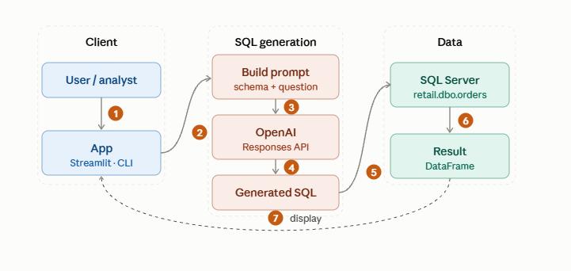
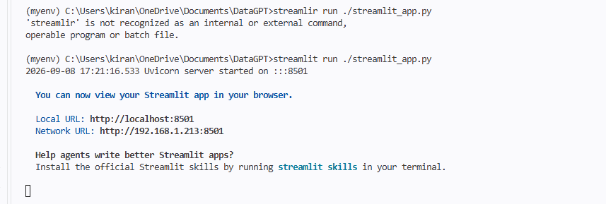
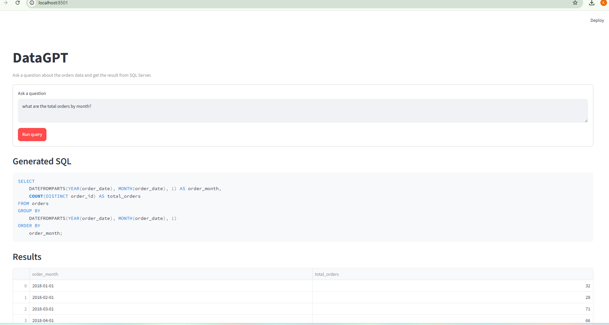
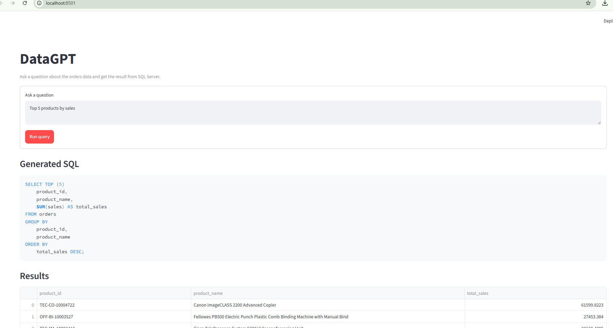
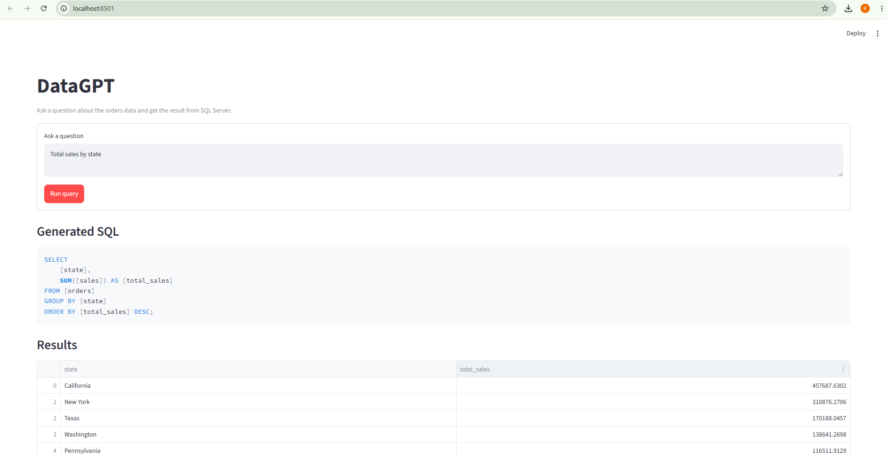
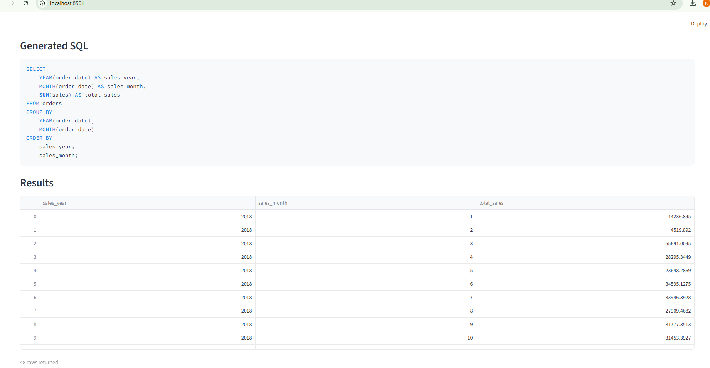

# DataGPT

**Natural-language querying for Microsoft SQL Server, powered by an LLM.**

DataGPT lets a business user ask a question in plain English — *"What are the total orders by month?"* — and get back a live result set from the database, with no SQL written by hand. It reads the schema of the `orders` table, asks an OpenAI model to translate the question into SQL, runs that SQL against SQL Server, and returns the rows to the screen.

> **Status:** Working prototype. Proven end-to-end on a single table. Not yet hardened for production — see [Current State Assessment](#current-state-assessment).

---

## Executive summary

| | |
|---|---|
| **What it is** | A lightweight AI SQL assistant that turns plain-English questions into executed queries against SQL Server. |
| **Who it's for** | Analysts and business users who need answers from data but don't write SQL. |
| **Why it matters** | Removes the analyst-as-bottleneck for routine data questions and shortens time-to-answer from hours to seconds. |
| **How it's used** | Two entry points — a browser app (Streamlit) for interactive use, and a CLI for quick testing. |
| **Where it stands** | Functional prototype scoped to one table, with hardcoded connection details and no query-safety layer. |
| **What's next** | Broaden beyond one table, add a SQL validation/safety layer, and externalize configuration. See [Roadmap](#recommendations--roadmap). |

**The bottom line:** DataGPT demonstrates a credible, low-cost path to self-service analytics. The core loop works today. The gap to production is well understood and addressable — it's engineering hardening, not a research question.

---

## The business case

Most routine data questions don't need a data engineer — they need a fast, reliable translation from *question* to *query*. Today that translation is a manual step that consumes analyst time and creates a queue. DataGPT collapses that step.

Typical questions it's built to answer:

- What are the total sales by month?
- Which customers placed the most orders?
- Show the top 10 products by revenue.

The value is not novelty — it's **throughput and access**. Business users get answers directly; skilled analysts are freed from repetitive query-writing to focus on higher-value work.

---

## How it works

At a conceptual level, every request follows the same five-step loop:

1. **Load** the database schema from SQL Server.
2. **Compose** a prompt combining the schema and the user's question.
3. **Generate** SQL by sending that prompt to the OpenAI API (instructed to return SQL only).
4. **Execute** the generated query against SQL Server.
5. **Display** the returned rows in the app or terminal.

Grounding the model in the live schema is what keeps the generated SQL aligned to the real table structure rather than a guess.

### Architecture



## Solution components

DataGPT is deliberately small — four working files, each with one job.

### `mydb.py` — the data layer

Owns the connection to SQL Server and everything schema-related.

- Creates a SQLAlchemy engine and connects via `pyodbc`.
- Runs queries with `pd.read_sql`.
- Fetches column metadata from `INFORMATION_SCHEMA.COLUMNS` for a given table.

**Current assumptions (hardcoded):**

- Database: `retail`
- Instance: `localhost\MSSQLSERVER03`
- Schema target: `dbo.orders`

### `streamlit_app.py` — the interactive web app

The primary user-facing experience.

- Sets up the page layout and takes a question from the UI.
- Fetches the schema once, cached, to avoid repeated lookups.
- Builds the schema-plus-question prompt and calls the OpenAI API.
- Shows the generated SQL, runs it, and displays the result table.

### `main.py` — the CLI

A stripped-down version of the same loop for terminal use. Loads environment variables, fetches the `orders` schema, requests SQL, executes it, and prints the result. This is the fastest way to validate the core idea without launching the web app.

### `requirements.txt` — dependencies

The Python packages the project needs (listed under [Tech stack](#tech-stack)).

### Project structure

```text
DataGPT/
├── main.py                  # CLI version of the SQL generation flow
├── mydb.py                  # SQL Server connection, schema fetch, and query runner
├── streamlit_app.py         # Web UI for natural-language SQL generation
├── requirements.txt         # Python dependencies
├── .env                     # Local environment variables (not committed)
├── .gitignore               # Ignores generated local files and secrets
├── myenv/                   # Local virtual environment
├── __pycache__/             # Python cache files
└── README.md                # Project documentation
```

---

## Tech stack

Python · Streamlit · SQLAlchemy · pyodbc · pandas · OpenAI Python SDK · python-dotenv · Microsoft SQL Server

---

## Getting started

### Prerequisites

1. Python installed.
2. Microsoft ODBC Driver 18 for SQL Server installed on the machine.
3. An accessible SQL Server instance.
4. A valid OpenAI API key.
5. A database named `retail` with a table named `orders` in the `dbo` schema.

### Environment

Create a `.env` file in the project root:

```env
OPENAI_API_KEY=your_openai_api_key_here
```

Confirm the SQL Server details in `mydb.py` match your local environment.

### Install

```bash
pip install -r requirements.txt
```

If you're using the bundled virtual environment in `myenv`:

```bash
# Command Prompt
myenv\Scripts\activate

# PowerShell
.\myenv\Scripts\Activate.ps1
```

### Run

```bash
# CLI — prompts for a question, generates and runs SQL, prints results
py main.py

# Web app — open the local URL shown in the terminal
streamlit run streamlit_app.py
```

On launch, Streamlit confirms the app is serving locally:

```text
You can now view your Streamlit app in your browser.

  Local URL:   http://localhost:8501
  Network URL: http://<your-lan-ip>:8501
```



*Streamlit dev server started on port 8501 during a local run.*

---

## Examples in action

Real queries run against the `orders` table through the Streamlit app. Each shows the plain-English question, the SQL the model generated, and a sample of the returned rows.

### 1. Total orders by month

> **Ask:** *what are the total orders by month?*



*Monthly order counts returned live from SQL Server.*

### 2. Top 5 products by sales

> **Ask:** *give me top 5 products by sales*



*Top products ranked by summed sales.*

### 3. Total sales by state

> **Ask:** *give me total sales by state*



*Sales aggregated by state, California leading.*

### 4. Total sales by year and month

> **Ask:** *give me total sales by year and month* — returns all 48 months (2018–2021).



*48 monthly rows spanning 2018–2021.*

---

## Current state assessment

An honest read of where the prototype stands today. None of these are blockers to *demonstrating* value — they're the difference between a demo and a deployable tool.

| Area | Current state | Implication |
|---|---|---|
| **Scope** | Fixed to the single `orders` table. | Can't answer cross-table or multi-entity questions. |
| **Configuration** | Connection details hardcoded in `mydb.py`. | Every environment change requires a code edit. |
| **Output reliability** | Model is instructed to return SQL only, but output can still vary. | Occasional malformed or unexpected queries. |
| **Data assumptions** | Assumes the schema is valid and consistent with the questions asked. | Fragile against schema drift or off-topic questions. |
| **Query safety** | No validation layer before execution. | Generated SQL runs directly — no guard against unsafe operations. |

---

## Recommendations & roadmap

Prioritized by effort-to-value. The sequencing matters: safety and configuration should land before broadening scope, so the surface area grows on a stable base.

### Priority 1 — Harden the foundation (near-term)

- **Add a SQL validation/safety layer** before execution — allowlist read-only operations, block writes/DDL, enforce query limits. *This is the single highest-value fix.*
- **Externalize configuration** into a settings/config file, replacing hardcoded connection details.
- **Add logging** for queries and errors to support debugging and auditability.

### Priority 2 — Broaden capability (mid-term)

- **Support multiple tables** rather than only `orders`.
- **Introspect all tables dynamically** so the schema context isn't manually scoped.
- **Add tests** around schema loading and query execution to lock in reliability as scope grows.

### Priority 3 — Enterprise readiness (strategic)

- **Add authentication and permissions** so access maps to who should see what.
- **Enforce per-user query limits and safety checks** at the access-control layer.

---

## Security & governance

DataGPT sends database schema information and user prompts to an external OpenAI API. Before any production use:

- Keep API keys in a secure environment, never in source.
- Restrict database access to the minimum required permissions (read-only where possible).
- Avoid exposing sensitive schema or data in prompts.
- Validate generated SQL before running it against production systems.

---

## Summary

DataGPT is a clean demonstration of an AI-plus-SQL workflow: natural-language input, schema-grounded prompting, LLM-generated SQL, live execution against SQL Server, and immediate results. The core loop is proven. With a safety layer, externalized configuration, and multi-table support, it's a solid foundation for a genuine self-service business intelligence assistant.
